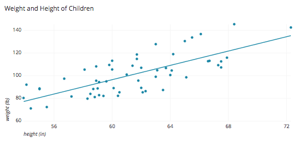

# Basic Practice with R Markdown

So this is an R Markdown document. You can make this into a PDF, Word, or HTML file (along with slides, Github docs, and others) and they look pretty spiffy. You just create a new "R Markdown" document and can start typing on this after deleting everything else except the --- title, author, date, output ---. To create a document, you write plain text like you would on a word document, which is different than an R script file. To write code, you need to create code chunks to type in, which we will learn how to do later in the document. To produce the PDF, Word, HTML, etc. files, you need to "knit" the R file using the `Knit` function which you can find at the top left of the coding window. 

You can do a lot in R Markdown including writing entire manuscripts and reports. For this course, I will expect all assignments, exercises, and projects to be completed in R Markdown. 

## Basic Text Formating

This section will go over basic text formatting within R Markdown specifically. You will only be able to see the results of formatting in the output file. 

### Headings
# Heading 1 
## Heading 2
### Heading 3

These headings are created with a pound sign before the words. The greater number of pound signs, the smaller the text. There must be a space between the pound sign(s) and heading text. 

### Bold

Make text **bold** by using **double asterisks** or __double underscores__ around words. 

### Italics

Make text *italic* by using a *single asterisk* or _single underscore_ around words.

### Strikethrough

Make text ~~strikethrough~~ by using ~~double tildes~~ around words. 

### Code

Make text look like `code` from a regular R script using `single accent marks` around words. 

### Superscripts and Subscripts

Make a ^superscript^ by using ^single^ ^carrots^ around words. 

Make a ~subscript~ by using ~single tildes~ around words. 

### Endash, emdash, and ellipsis

- Endash: double hyphen --

- Emdash: triple hyphen ---

- ellipsis: triple period ...

### Inline equations

R has a lot of words you can make symbols with for equations. To put in an $inline equation$, surround the text with $single dollar signs$.

For example, the area of a circle: $A = \pi*r^{2}$ 

### Bullet Points

- Make bullet points using hyphens or asterisks and then a hard return between points (2 returns). 

- There must be a space between the hyphen and text for it to become a bullet point.

* asterisk point

* asterisk point 2

    * Point 2a has a double tab before the asterisk or hyphen
  
    * Point 2b

### Numbered list

1. Make a numbered list by always putting **1.** and then a space at the beginning of your text. 

1. Hard return between numbers. 

1. Notice how in the second and third points the **1.** is still at the beginning of the line, R automatically changes the numbers in the output to be the correct order. 

### Links

You can even embed internet links directly into this document.

Download the latest version of R Studio at <https://www.rstudio.com/>. Use simple less than/greater than signs around the text to create an html link; this way shows the web address. 
If you don't want to include the web address use brackets and parentheses instead: 
Download the latest version of [R Studio](https://www.rstudio.com/). The brackets create a hyperlink for the words within them and the parentheses house the web address. 

### Images

Embed image links from your computer into this file. This is very similar to the second method of embedding an internet link, but a **!** is included in front of the brackets. Use text within the brackets to make a caption for the image. The image location should be within a sub folder inside the same folder as this R Markdown document. Here, it is located within the folder "Figures" inside the larger folder "R Basics". 

Below is an image of a basic scatterplot. 




### Block Quote

To add a block quote, use a greater than sign *>* at the beginning of text. 

> "Do or do not, there is no try."

### Tables

Hand type a table using various horizontal and vertical dashes.  

--------------

Sex  | Age
---- | ----
F    | 25
M    | 32
F    | 31
F    | 29

### Page Break

To make page breaks put three hyphens in a row and then a hard return

---

There's a lot of other cool stuff you can add in with R Markdown. If you're interested in learning about the other cool stuff look at the [R Markdown Cheat Sheet](https://www.rstudio.com/wp-content/uploads/2016/03/rmarkdown-cheatsheet-2.0.pdf). Here are [other cheat sheats for R](https://www.rstudio.com/resources/cheatsheets/#rmarkdown). 

---

## Coding and Knitting

Everything you do in R or R Studio can be done in R Markdown, making it a powerful tool for creating any document containing all the information needed (i.e. introduction, annotated data analysis, figures, etc.). It's very convenient to create a document in R Markdown that contains your background, code, data interpretation, etc. to show to colleagues, advisors, agency personel you may be working with, etc. 


### Code Chunks

You can enter R script directly into the document! Just use the insert drop down above this viewing box or *CTRL + ALT + I*.

```{r blank}
#code gets to go here
```

`blank` is the name I gave to this code chunk. Naming allows you to sort code chunks and cache some together for later use. 

You can even hide the R script if you want to run something, but not have it show in the final knitted document with the `echo=FALSE` function. There are a lot of different functions you can put in the header of an R chunk. Look at the cheatsheet for help or get a full list of (60+!) arguments [here](http://yihui.name/knitr/options). 

```{r hide, echo=FALSE}
#hidden R script using the echo function, will still show results from code
#Helpful when the code is unneccessary or messy to show. 
```

```{r, echo=FALSE}

```

```{r do not run, eval=FALSE}
#eval=FALSE prevents the code from running when knitted together. 
#This is good for example code.
```

```{r run but do not include, include=FALSE}
#include=FALSE code will run, but the output and code won't be in the knitted document 
#This good for setup code like installing and loading packages and setting global parameters
```

```{r no warnings, message=FALSE, warning=FALSE}
#mesage/warning=FALSE prevents messages and warnings from stopping the running of code 
#If any warnings appear otherwise, the document will NOT be knitted. 
```

```{r hide output, results='hide', fig.show='hide'}
#results/fig.show='hide' hides the output of results like ANOVA tables and model selection (results) as well as plots and other figures (fig.show) 
```

```{r ignore error, error=TRUE}
#error=TRUE will run the code even if normally there is an error that prevents the code from running, stopping the knitting of the document. No output is produced because the code doesn't work.
```

```{r caching, cached=TRUE, dependson="name of previous code chunk", eval=FALSE}
#If you have a chunk that takes a while to run (e.g. loading or filtering spatial data), you can cache it to save for later (cached=TRUE). R will only run this chunk if the code has changed (not if the data itself has changed!). If this chunk depends on data from another chunk before running, name that chunk with the dependson="name of chunk" argument
```

When you add in R code, unless you write commands associated with echo, warning, cache, print, etc. all of the output and code from your code will be printed once the document is knitted. That means that your graphs and other cool stuff you coded will be directly embedded into the document. 

### Global parameters 

If you want any of these arguments for the entire R Markdown document, it would be better to change the global parameters:

```{r global model, eval=FALSE}
knitr::opts_chunk$set( #this goes into the knitr package, uses the function opts_chunk to set global parameters
  echo=FALSE #we don't want the code to show throughout the whole document
)
```

### Inline code

You can put parts of code in sentences if you are looking at writing a more report style document. 

Our data contains `r nrow(trees)` trees with an average height of `r mean(trees$Height)`. Below is a histogram of tree heights: 
```{r histogram, echo=FALSE}
hist(trees$Height)
```

### Knitting

When you're done with R Markdown and your entire document, click the `Knit` button above this window or *CTRL + SHIFT + K*. If you have any errors in your code, it will not run the entire way and will give you an error. These errors are frustrating to deal with at times. 

### Conclusion

You can now create basic and more advanced R Markdown documents will a little bit of creativity and practice. 

Reminder: I expect all exercises to be conducted in R Markdown for this course. 

There is a lot more you can do with R Markdown, but this covers some of the basic writing and coding structures. I recommend Hadley Wickham and Garrett Grolemund's book, [R for Data Science](https://smile.amazon.com/Data-Science-Transform-Visualize-Model-ebook/dp/B01NAJAEN5/ref=sr_1_3?keywords=r+for+data+science&qid=1558640517&s=gateway&sr=8-3). 

# Exercises

For the following exercises, separate each one using a heading and end with a page break. 

1. Write a short paragraph on your research using 4 different text formattings. 

1. Show your favorite quote in inline quote form. 

1. Write a sentence describing and put in a link to your favorite website. 

1. Write a sentence describing and embed a picture of choice. 

1. Write a sentence describing at least two summary statistics from the `cars` dataset. Proceed by showing a graph of some aspect of the data that does not print the code. 

1. `Knit` the document into an HTML file. 